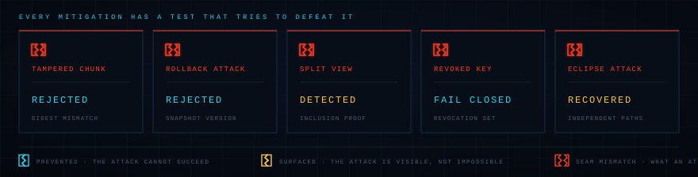
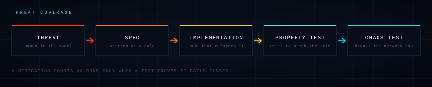

<p align="center">
  
</p>

<p align="center">
  <a href="01_PRD.md">PRD</a> ·
  <a href="02_TECHNICAL_ARCHITECTURE.md">Architecture</a> ·
  <a href="03_SECURITY_AND_ACCESS.md">Security &amp; threat model</a> ·
  <a href="04_FRONTEND_SPEC.md">CLI spec</a> ·
  <a href="THREAT_COVERAGE.md">Threat coverage</a> ·
  <a href="DECISIONS.md">Decisions</a>
</p>

---

## What is Tessera?

Tessera is a verified-by-default distribution system for machine learning models and datasets.

Publishers sign once. Any number of untrusted mirrors distribute bytes. Every consumer verifies
locally that what it received is exactly what the publisher signed.

A mirror can deny availability. It cannot forge authenticity.

### Core guarantees

- No unverified fetch path exists.
- Mirrors never become trust anchors.
- Consumers verify every byte locally.
- Content stays verifiable across any number of mirrors.
- Key compromise is recoverable without sacrificing integrity.
- Previously trusted artifacts remain auditable.

Everything below explains how those six are enforced, and links to the real spec section for each.

## Quickstart

```sh
# publisher, once
tessera keygen --role root --out root.key
tessera keygen --role release --out release.key
tessera keygen --role timestamp --out ts.key
tessera publisher init acme-lab --root-key root.key --store ./origin-store
tessera publisher delegate --role release --key release.key.pub --root-key root.key --store ./origin-store
tessera publisher delegate --role timestamp --key ts.key.pub --root-key root.key --store ./origin-store

# publish a release, keep freshness alive, serve it
tessera publish ./bert-tiny --name bert-tiny --version 1.2.0 --type model \
    --release-key release.key --store ./origin-store
tessera origin reissue-timestamp --store ./origin-store --timestamp-key ts.key
tessera origin serve --store ./origin-store --bind 0.0.0.0:7433

# mirror, no credentials, no trust
tessera mirror sync <fingerprint> --from http://origin:7433 --store ./mirror-store
tessera mirror serve --store ./mirror-store --bind 0.0.0.0:7433

# consumer, trusts only the pinned fingerprint
tessera trust add acme-lab <fingerprint> --mirror http://origin:7433
tessera fetch acme-lab/bert-tiny@1.2.0
tessera verify ./bert-tiny --ref acme-lab/bert-tiny@1.2.0
tessera status acme-lab
```

Nothing is written to `verified/` until every gate in the pipeline below clears. A failed fetch
leaves no partial artifact.

## Architecture



Mirror B is compromised. It serves altered bytes and the fetch still succeeds, because a mirror
was never load-bearing for authenticity in the first place.

Detail: [02_TECHNICAL_ARCHITECTURE.md](02_TECHNICAL_ARCHITECTURE.md)

## Threat model



Two of these are honest amber rather than cyan. A split view is **detected**, not prevented. An
eclipse is **recovered from**, which means it happened. Tessera does not claim to stop either.

Full model, including what is explicitly out of scope: [03_SECURITY_AND_ACCESS.md](03_SECURITY_AND_ACCESS.md)

## Verification pipeline



The consumer holds exactly one piece of trusted state: the pinned root fingerprint. Every other
claim in the chain (V1 through V10) is proven against it locally, offline where possible, with no
network in the trust path.

## Security guarantees

| Property | Enforced by |
|---|---|
| Mirrors cannot poison content | content addressing (BLAKE3) |
| Every fetch is verified locally | DSSE + manifest (V6) |
| Rollback is detected | consumer-persisted high-water marks (V2/V4/V6) |
| Root rotation is supported | offline root, TUF-style cross-signing (V2) |
| Compromised keys are revocable | fail-closed, retroactive revocation (V3) |
| Provenance is cryptographically linked | signed attestation, bound to the manifest both ways (V10) |
| Transparency detects equivocation | inclusion + consistency proofs, cross-source checks (V7) |

## What is in the box

| | |
|---|---|
| **Content addressing** | Every chunk is named by its own BLAKE3 digest. |
| **DSSE** | Signatures bind the payload and its type. |
| **Transparency log** | Publish once, prove it in public. |
| **Provenance** | Every artifact traces back to a declared origin. |
| **Rollback protection** | An old snapshot never replaces a newer one. |
| **Freshness** | Signed timestamps bound how stale a view can be. |
| **Multi mirror** | Any number of carriers, none of them trusted. |
| **Key rotation** | Roots change without breaking existing trust. |

## Security lifecycle

**Publish**

1. **Generate keys.** Root created offline. It never touches a network.
2. **Delegate.** Root signs the release and timestamp keys into the root document.
3. **Publish.** Manifest signed once. Chunks written to content-addressed storage.

**Carry and consume**

4. **Mirror.** Any host copies the bytes. No credentials needed.
5. **Fetch.** Consumer pulls from whichever configured mirror answers, scored by reliability.
6. **Verify.** Ten gates run locally against the pinned root alone.
7. **Materialize.** Signed bytes land on disk. Nothing else does.

**Recover**

8. **Rotate.** A new root, cross-signed by the old one. Trust carries over, no re-pin needed.
9. **Revoke.** A compromised key stops verifying everywhere at once, retroactively.

## Why Tessera?

The realistic alternative is a mirror serving a checksum file next to the artifact. That checksum
is served by the same host as the bytes, which means it proves nothing about a host you do not
trust.

| Problem | Mirror + checksum file | Tessera |
|---|---|---|
| Mirror compromise | trusted by default | **safe** |
| Rollback | undetected | **protected** |
| Tampered bytes | only if the host is honest | **rejected** |
| Split view | invisible | **detected** |
| Offline verification | no | **yes** |
| Provenance | none | **yes** |

## Threat coverage



Every threat named in the model travels the full width of that diagram. A mitigation counts as
done only when a test proves it fails closed, not when the code exists.

Full matrix, one row per threat with its proving test file: [THREAT_COVERAGE.md](THREAT_COVERAGE.md)

## Design decisions

| | Decision | Status | Why |
|---|---|---|---|
| **D5** | Three key roles: offline root, online release, online timestamp | accepted | The minimum role set the threat model needs. |
| **D10** | Python for all four milestones | accepted | Native-speed hashing via the `blake3` binding, Hypothesis for property-based adversarial tests. Rust noted only as a post-M4 option for a standalone mirror daemon. |
| **D13** | Revocation is retroactive and fail-closed, no time-based carve-out | accepted | Without trusted timestamping there is no sound way to tell a pre-compromise signature from a backdated one. |
| **D24** | A root document's `revoked` list is cumulative across versions | accepted | A single verified root document already carries its own full revocation history; no need to re-walk the chain. |

42 decisions recorded end to end, including every real bug found while building and testing this: [DECISIONS.md](DECISIONS.md)

## Documentation

| | |
|---|---|
| [Product requirements](01_PRD.md) | [Technical architecture](02_TECHNICAL_ARCHITECTURE.md) |
| [Security & threat model](03_SECURITY_AND_ACCESS.md) | [CLI / frontend spec](04_FRONTEND_SPEC.md) |
| [Design decisions](DECISIONS.md) | [Threat coverage matrix](THREAT_COVERAGE.md) |

## Install (development)

```sh
python3 -m venv .venv
.venv/bin/pip install -e ".[dev]"
```

## Run the tests

```sh
.venv/bin/pytest
```

This runs the unit suite; the T1, T2A, T2B, T4A, T4B, T4C, T5B, T6A, T6B adversarial tests plus the
M4 combined chaos scenario (T1+T2b+T6a against one fetch), all in-process tampering-mirror /
lookalike-key / stale-mirror / root-rotation / key-revocation / split-view / eclipse / Sybil-flood
fixtures, built from real Tessera code, not mocks; the PBT-MANIFEST-MUTATE, PBT-CHUNK-MUTATE,
PBT-HISTORY-MONOTONE, and transparency-log Merkle-proof property tests, plus M4's parser fuzzing
(structurally-arbitrary, not single-byte-mutated, input across every
envelope/manifest/root/timestamp/checkpoint/provenance/snapshot/proof parser; use
`--hypothesis-profile=thorough` for a deeper, opt-in 1000-example pass); and end-to-end scripted
scenarios driven through the real `tessera` CLI, including a multi-mirror resilience run, a mirror
sync/serve round trip, a full ceremony walkthrough (provenance-carrying publish, dataset record
diff, rotate, revoke, `--resign-all` recovery, and `status`), and the compromise-playbook drills.

## License

Not yet chosen.

---

<p align="center">
  <b>Trust the signature. Never the transport.</b>
</p>
